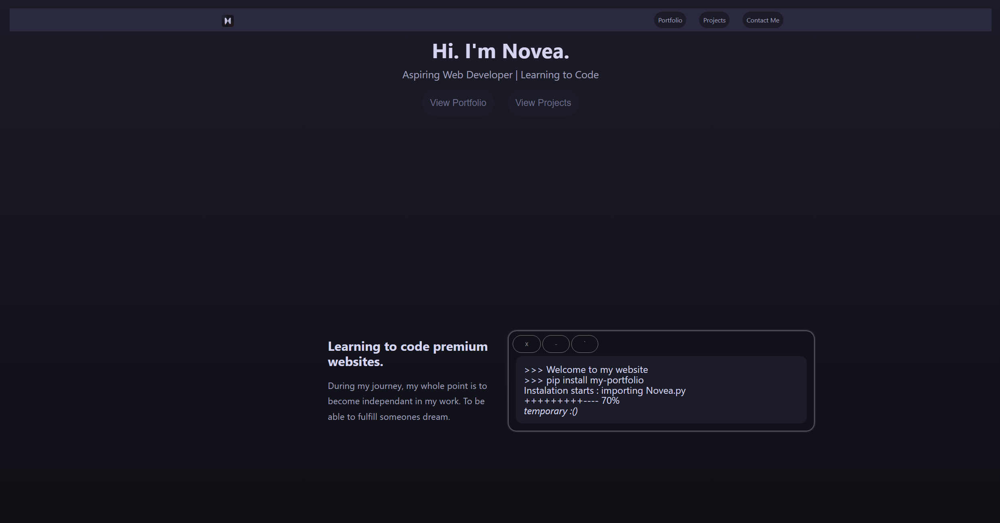
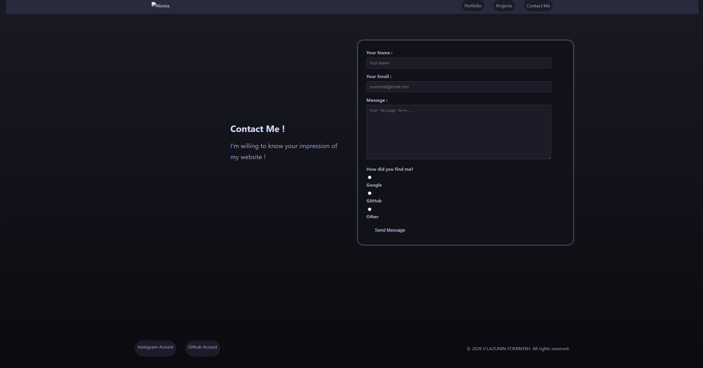

# My Personal Portfolio Website

My first website built while learning web development. This project showcases what I've learned in Week 1: HTML, CSS, Flexbox, Grid, and Responsive Design. This project is my Portfolio SO it's going to be Always updated. No matter what.

## 🚀 Features

- Responsive design (mobile, tablet, desktop)
- Modern navigation bar
- Contact form
- Skills showcase
- Project cards
- Smooth animations

## 🛠️ Technologies Used

- HTML5
- CSS3
- Flexbox
- CSS Grid
- Responsive Design

## 📸 Screenshots




## 🔗 Live Demo

[View Live Website](https://novea-portfolio.netlify.app/portfolio) ← Add after deployment

## 💻 Local Development

1. Clone the repository

   ```bash
   git clone https://github.com/VolodymyrLazunin-Fominykh/my-portfolio-website.git
   ```

2. Open `index.html` in your browser

## 🎯 What I Learned

- HTML semantic structure
- CSS styling and layouts
- Flexbox for navigation and cards
- CSS Grid for project gallery
- Media queries for responsiveness ( not a lot, tried responsiveness on its own)
- Git and GitHub workflow

## 🔮 Future Improvements

- [ ] Add JavaScript interactivity
- [ ] Improve and Make contact form functional
- [ ] Add more projects
- [ ] Improve animations
- [ ] Improve Navigation bar
- [ ] Add light mode

## 👤 Author

[Your Name]

- Learning Journey: Week 1 of 3-Month Bootcamp
- GitHub: [@VolodymyrLazunin-Fominykh](https://github.com/VolodymyrLazunin-Fominykh)

## 📄 License

This project is open source and available for learning purposes.
